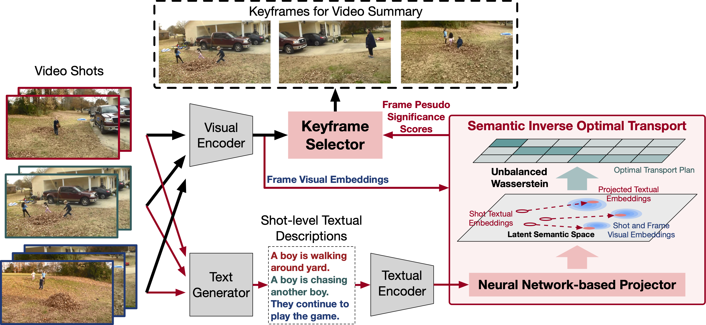

# Video-Summary-IOT
The official github for ACM MM 2023 paper "**Self-supervised Video Summarization Guided by Semantic Inverse Optimal Transport**"



## ⏳Project Struture
```
.
├── dataset
│   ├── h5_files
│   ├── pseudo_scores (generated pseudo scores)
│   ├── splits (split files)
│   ├── v_feat (extracted visual features)
│   └── w_feat (extracted textual features)
├── raw_data
│   ├── SumMe
│   │   ├── mp4video_shot10_avi (avi format, segmented shots)
│   │   ├── mp4video (mp4 format, videos)
│   │   └── generated_texts
│   │   │   ├── shot10 (BMT captions for each video)
│   │   │   ├── shot10_all (BMT captions for each shot)
│   │   │   ├── shot10_new (HiTeA captions for each video)
│   │   │   └── shot10_new_all (HiTeA captions for each shot)
│   ├── TVSum
│   ├── OVP
│   ├── Youtube
│   └── Wikihow
└── src
```

## ⚙️Main Dependencies
- python=3.7.11
- pytorch=1.10.2
- matplotlib=3.5.3 
- numpy=1.21.6
- opencv-python=4.6.0.66
- scikit-learn=1.0.2
- sk-video=1.1.10
- scipy=1.7.3
- tqdm=4.64.1
- ortools=9.5.2237

## ⏬Data

### Download raw data
For the raw videos, you can download them from these links: [SumMe](https://gyglim.github.io/me/vsum/index.html), [TVSum](http://people.csail.mit.edu/yalesong/tvsum/), [OVP](https://sites.google.com/site/vsummsite/download), [Youtube](https://sites.google.com/site/vsummsite/download), [Wikihow](https://github.com/medhini/Instructional-Video-Summarization). 
You can download h5 files and split files from [VASNet](https://github.com/ok1zjf/VASNet). Split files can also be found in ```./dataset/splits/```. 

### Generate captions
We recommend using [HiTeA](https://www.modelscope.cn/models/damo/multi-modal_hitea_video-captioning_base_en/summary) to generate captions. You can use the codes in ```./src/caption-generation/```: 
```
python generate_captions_modelscope_multi.py
python synthesize_shot_texts.py
```
Note that here the input to HiTeA is video clips whose duration is 10s(20s for TVSum dataset), so you need to segment the raw video first by using the code in ```./src/utils/```. The video shots (with avi format) should be put at ```./raw_data/dataset/mp4video_shot10_avi/```. 

You can also generate captions through the [BMT](https://github.com/v-iashin/BMT) model. The difference between the two types of text can be seen in the appendix section of the paper. 

### Extract features 
We use [CLIP](https://github.com/openai/CLIP) to extract visual and textual features, the codes can be found in ```./src/feature-extraction/```. You can also use GoogleNet features (through h5 files) and [S3D](https://github.com/antoine77340/S3D_HowTo100M) features. 

### Train text projector
Before running the training command, please set:
- `args.dataset`: Training dataset name, e.g., "SumMe/TVSum/OVP/Youtube/Wikihow".
- `args.gpu`: GPUs you are using, e.g., "0,1,2,3". (4 RTX 3090 GPUs in my case)
- `exp`: Path of your saving directory.

You can use the codes in ```./src/text-projection/```: 
```
python train_text_projector.py
```
Finally, you can get the trained text projector saved in ```./exp/network_w.net``` and projected textual features saved in ```./exp/{}_projected_text_feats_norm.pkl```. 

### Generate pseudo scores
Before running the command, please set:
- `args.dataset`: Training dataset name, e.g., "SumMe/TVSum/OVP/Youtube/Wikihow".
- `args.gpu`: GPUs you are using, e.g., "0,1,2,3". (4 RTX 3090 GPUs in my case)
- `exp`: Path of your saving directory.
- `args.threshold`: Threshold in the alignment score.
- `args.recon_threshold`: Threshold in the representation score.

You can use the codes in ```./src/pseudo-score/```: 
```
python generate_pseudo_scores.py
```
Note that pseudo-scores are saved as the negative of its value. When using the scores, they are also read as the negative value. You can get the pseudo-scores in the directory ```./exp/{}_ot_scores.pkl```. 

## 💻Usage
### Train keyframe selector and Evaluation
Before running the command, please set the following items in ```./src/configs.py```:
- `args.dataset_setting`: Training dataset name and data settings.
- `args.gpu`: GPUs you are using, e.g., "0,1,2,3". (4 RTX 3090 GPUs in my case)
- `args.summary_rate`: Pre-defined summary length.
- `args.input_size`: Dimension of input features, 512 for CLIP and S3D, 1024 for GoogleNet.

After placing the data (h5 files, pseudo scores, splits, v_feats, w_feats) correctly, you can use the codes in ```./src/```: 
```
python main.py
```


## 📖Citation
Please cite our paper if you use this code or any of the models:
```
```

## 💐Acknowledgements
Our work builds on and uses code from [SUM-GAN](https://github.com/j-min/Adversarial_Video_Summary) and [US-FGW](https://github.com/hhhh1138/Temporal-Action-Alignment-USFGW). Thanks!


